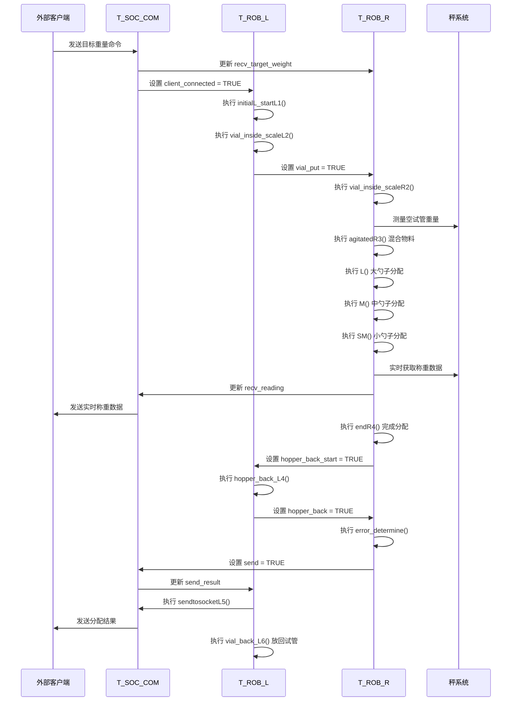

# ABB 机器人项目详细设计文档

## 1. 系统概述

### 1.1 项目背景
本项目基于 ABB YuMi 双臂机器人，实现自动化物料分配系统。系统通过左右机械臂协同工作，完成试管取放、物料分配、称重等功能，并通过 socket 通信与外部系统进行数据交互。

### 1.2 整体架构
系统由三个主要任务模块组成，通过共享变量实现协同工作：

| 模块名称 | 主要职责 | 文件路径 |
|---------|---------|---------|
| T_ROB_L | 左机械臂控制，负责试管处理 | Robot/RAPID/T_ROB_L/PROGMOD/MainModule.mod |
| T_ROB_R | 右机械臂控制，负责物料分配 | Robot/RAPID/T_ROB_R/PROGMOD/MainModule.mod |
| T_SOC_COM | Socket 通信，负责与外部系统交互 | Robot/RAPID/T_SOC_COM/PROGMOD/MainModule.mod |

### 1.3 通信架构
- **内部通信**：通过共享变量实现模块间数据共享
- **外部通信**：通过 TCP/IP Socket 与外部系统通信
  - 端口 1025：用于接收称重数据
  - 端口 1023：用于接收控制命令

## 2. 控制流程

### 2.1 主流程
1. 系统初始化：T_SOC_COM 启动 socket 服务器
2. 左机械臂初始化：T_ROB_L 回到初始位置，准备试管处理
3. 右机械臂初始化：T_ROB_R 回到初始位置，准备物料分配
4. 试管处理：左机械臂从试管架取试管，放置到临时位置
5. 物料分配：
   - 右机械臂将试管放入秤中
   - 右机械臂使用大/中/小勺子分配物料
   - 基于称重结果调整分配量
6. 结果处理：
   - 计算分配精度
   - 通过 socket 发送结果
   - 左机械臂将试管放回试管架
7. 循环执行：等待下一个分配任务

### 2.2 模块间交互流程

## 3. 变量定义

### 3.1 共享变量（跨模块使用）

| 变量名 | 类型 | 所属模块 | 用途 |
|-------|------|---------|------|
| client_connected | bool | T_SOC_COM | 标识客户端连接状态 |
| recv_reading | num | T_SOC_COM | 从秤接收的实时重量 |
| recv_target_weight | num | T_SOC_COM | 目标分配重量 |
| ready_new_command | bool | T_SOC_COM | 标识系统准备好接收新命令 |
| result{5} | num{5} | T_SOC_COM | 分配结果数组 [精度, 差值, 目标重量, 样本数, 状态值] |
| send_result | bool | T_SOC_COM | 标识结果准备好发送 |
| recv_stable | bool | T_SOC_COM | 标识称重数据稳定 |
| shake | num | T_SOC_COM | 模糊控制器输出的抖动参数 |
| a_smallspoon | num | T_SOC_COM | 小勺的角度参数 |
| weight_vial | num | T_SOC_COM | 空试管重量 |
| leftfinish | bool | T_ROB_L | 标识左机械臂任务完成 |
| vial_put | bool | T_ROB_L | 标识试管已放置到临时位置 |
| hopper_back | bool | T_ROB_L | 标识料斗已返回 |
| hopper_back_start | bool | T_ROB_L | 触发料斗返回的标志 |

### 3.2 模块特有变量

#### T_ROB_L 关键变量
| 变量名 | 类型 | 用途 |
|-------|------|------|
| tool1 | tooldata | 左机械臂工具数据 |
| wobjCalib | wobjdata | 左机械臂工作对象校准数据 |
| p1-p6 | robtarget | 试管架参考位置 |
| no_vials_now | num | 当前处理的试管总数 |
| reg_novials_now | num | 试管在试管架中的相对位置 (0-15) |

#### T_ROB_R 关键变量
| 变量名 | 类型 | 用途 |
|-------|------|------|
| wobjCalibR | wobjdata | 右机械臂工作对象校准数据 |
| difference | num | 目标重量与实际重量的平均差值 |
| small | bool | 标识当前使用小勺 |
| medium | bool | 标识当前使用中勺 |
| no_droping | num | 检测物料是否掉落的阈值 |

## 4. 函数实现

### 4.1 T_ROB_L 核心函数

#### LhomePos()
- **功能**：将左机械臂移动到初始位置
- **参数**：无
- **实现**：使用 MoveAbsJ 指令移动到预定义的关节位置
- **调用时机**：任务开始、任务切换时

#### pick_vial_ready()
- **功能**：从试管架拾取试管并放置到临时位置
- **参数**：无
- **实现**：
  1. 根据 reg_novials_now 计算试管位置
  2. 移动到试管位置
  3. 夹取试管
  4. 移动到临时放置位置
  5. 释放试管
- **调用时机**：试管处理阶段

#### vial_back_L6()
- **功能**：将试管从临时位置放回试管架
- **参数**：无
- **实现**：调用 backvial_rack() 完成具体放回操作
- **调用时机**：分配完成后

### 4.2 T_ROB_R 核心函数

#### main_()
- **功能**：右机械臂主控制流程
- **参数**：无
- **实现**：
  1. 初始化右机械臂
  2. 处理试管放入秤中
  3. 混合物料
  4. 依次使用大/中/小勺子分配物料
  5. 计算分配结果
  6. 完成分配，处理后续工作
- **调用时机**：系统启动后循环执行

#### calculate_difference()
- **功能**：计算目标重量与实际重量的差值
- **参数**：无
- **实现**：
  1. 等待称重数据稳定
  2. 连续获取 5 次称重数据
  3. 计算平均值作为实际重量
  4. 计算与目标重量的差值
- **调用时机**：每次分配物料后

#### L(), M(), SM()
- **功能**：分别使用大、中、小勺子进行物料分配
- **参数**：无
- **实现**：
  1. 拾取对应勺子
  2. 移动到物料位置
  3. 舀取物料
  4. 抖动勺子，控制物料掉落量
  5. 放回勺子
- **调用时机**：根据目标重量选择调用

### 4.3 T_SOC_COM 核心函数

#### ServerStart(bool Recover)
- **功能**：启动 socket 服务器
- **参数**：Recover - 标识是否为恢复模式
- **实现**：
  1. 如果是恢复模式，关闭现有 socket
  2. 创建并绑定 scale 服务器 (端口 1025)
  3. 创建并绑定 command 服务器 (端口 1023)
  4. 监听客户端连接
  5. 接受客户端连接
- **调用时机**：系统启动、连接异常时

#### Parsemsg(string msg)
- **功能**：解析从客户端接收的命令消息
- **参数**：msg - 待解析的字符串消息
- **实现**：
  1. 查找消息结束符 '#'
  2. 按空格分割参数
  3. 将参数转换为数值，存储到 command 数组
- **调用时机**：收到命令消息时

#### main()
- **功能**：socket 通信主循环
- **参数**：无
- **实现**：
  1. 初始化变量
  2. 启动服务器
  3. 循环处理：
     - 接收秤数据
     - 发送结果（如果准备好）
     - 处理命令消息
     - 更新共享变量
- **调用时机**：系统启动后一直运行

## 5. 功能设计

### 5.1 试管处理功能
- **功能描述**：左机械臂完成试管从试管架到临时位置的取放
- **实现流程**：
  1. 计算试管在试管架中的位置
  2. 移动到试管位置
  3. 夹取试管
  4. 移动到临时位置
  5. 释放试管
- **关键逻辑**：使用 reg_novials_now 变量计算试管位置，支持 16 个试管位置循环

### 5.2 物料分配功能
- **功能描述**：右机械臂使用不同勺子完成物料分配
- **实现流程**：
  1. 混合物料
  2. 根据目标重量选择勺子：
     - 目标重量 ≥ 0.8kg：使用大勺子 (L())
     - 0.1kg ≤ 目标重量 < 0.8kg：使用中勺子 (M())
     - 目标重量 < 0.1kg：使用小勺子 (SM())
  3. 实时获取称重数据，调整分配量
  4. 计算分配精度
- **关键逻辑**：基于模糊控制器输出的抖动参数和角度参数，精确控制物料掉落量

### 5.3 称重功能
- **功能描述**：实现精确称重和重量数据处理
- **实现流程**：
  1. 打开秤门
  2. 将试管放入秤中
  3. 关闭秤门
  4. 等待重量稳定
  5. 连续获取 5 次重量数据
  6. 计算平均值作为最终重量
- **关键逻辑**：使用 recv_stable 标志判断重量是否稳定

### 5.4 Socket 通信功能
- **功能描述**：实现与外部系统的数据交互
- **实现流程**：
  1. 启动两个 socket 服务器
  2. 接收外部客户端连接
  3. 接收秤数据和控制命令
  4. 解析命令，更新共享变量
  5. 发送分配结果
- **关键逻辑**：使用 JSON 格式进行数据交互，支持错误处理和连接恢复

## 6. 调试指南

### 6.1 常见问题及解决方案

| 问题现象 | 可能原因 | 解决方案 |
|---------|---------|---------|
| 机械臂不动作 | 1. 客户端未连接 2. 共享变量状态异常 | 1. 检查客户端连接状态 2. 重置相关共享变量 |
| 物料分配精度低 | 1. 抖动参数设置不当 2. 称重数据不稳定 | 1. 调整模糊控制器参数 2. 检查秤的稳定性 |
| Socket 连接断开 | 1. 网络异常 2. 客户端异常关闭 | 1. 检查网络连接 2. 等待自动恢复或手动重启 |
| 试管取放失败 | 1. 试管位置计算错误 2. 夹爪力度不当 | 1. 检查 reg_novials_now 变量 2. 调整夹爪力度参数 |

### 6.2 调试工具和方法

1. **示教器调试**：
   - 使用示教器查看变量值
   - 单步执行程序，观察机械臂动作
   - 查看 TPWrite 输出的调试信息

2. **日志分析**：
   - 查看系统日志，了解程序执行流程
   - 分析 socket 通信日志，检查数据传输

3. **变量监控**：
   - 重点监控共享变量，特别是：
     - client_connected：客户端连接状态
     - recv_reading：实时称重数据
     - difference：重量差值
     - send_result：结果发送状态

4. **分步调试**：
   - 单独测试左机械臂试管处理功能
   - 单独测试右机械臂物料分配功能
   - 单独测试 socket 通信功能
   - 最后进行集成测试

## 7. 未来扩展

### 7.1 功能扩展
- 支持多种物料类型切换
- 实现自动清洁功能
- 增加视觉系统，实现试管位置自动识别
- 支持远程监控和控制

### 7.2 性能优化
- 优化物料分配算法，提高分配速度和精度
- 优化通信协议，减少延迟
- 实现预测性维护功能

### 7.3 系统集成
- 与 MES 系统集成，实现生产数据管理
- 与仓库管理系统集成，实现物料自动补给
- 与质量管理系统集成，实现质量数据追溯

## 8. 总结

本设计文档详细描述了 ABB 机器人项目的系统架构、控制流程、变量定义、函数实现和功能设计。通过本文档，后续调试人员可以快速理解系统的工作原理，定位和解决问题，进行系统维护和扩展。

系统采用模块化设计，各模块职责明确，通过共享变量实现协同工作，具有良好的可维护性和扩展性。socket 通信模块实现了与外部系统的灵活交互，支持实时数据传输和远程控制。

在调试过程中，建议重点关注共享变量的状态变化，使用示教器和日志工具进行调试，按照分步调试的方法进行问题定位。